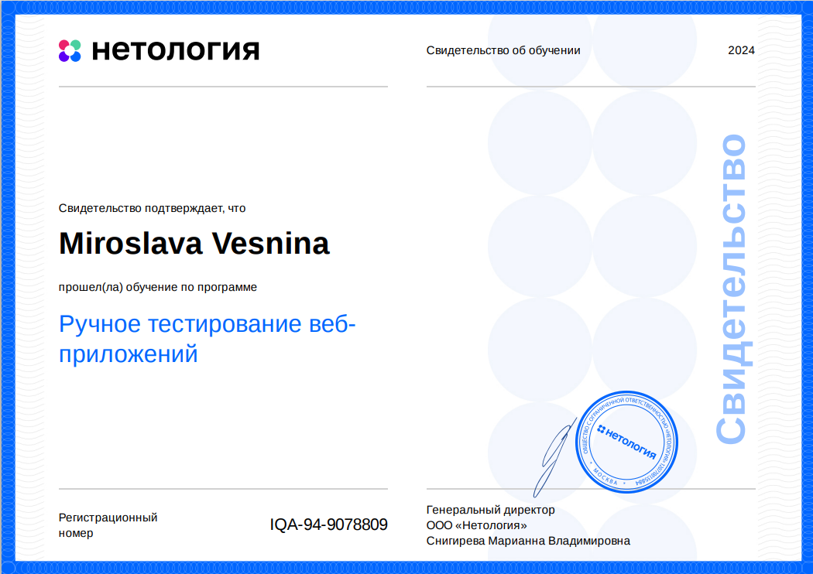

# Портфолио QA Engineer

В портфолио собраны проекты, выполненные во время обучения в Нетологии по специальности Инженер по тестированию.

## [Проектирование тестов](#1)
- Тест-анализ
- Тест-дизайн
- Классы эквивалентности
- Граничные значения
- Тестовая документация
- Чек-листы
- Тест-кейсы

## [Тестирование веб-приложений](#2)
    
- Пользовательский интерфейс
- Формы
- DevTools
- Таблицы принятия решений
- Баг-репорты
        

## Проектирование тестов 

### Тест-анализ

Здесь будет описание проекта

### Тест-дизайн

Здесь будет описание проекта

### Классы эквивалентности

Здесь будет описание проекта

### Граничные значения

Здесь будет описание проекта

### Тестовая документация

Здесь будет описание проекта

### Чек-листы

Здесь будет описание проекта

### Тест-кейсы

Здесь будет описание проекта

## Тестирование веб-приложений 

### Пользовательский интерфейс

Здесь будет описание проекта

### Формы

Здесь будет описание проекта

### DevTools

Здесь будет описание проекта

### Таблицы принятия решений

Здесь будет описание проекта

### Баг-репорты

Здесь будет описание проекта
